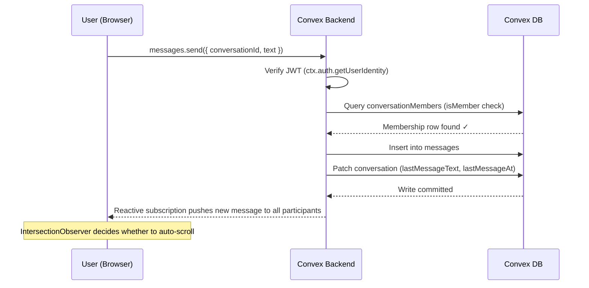
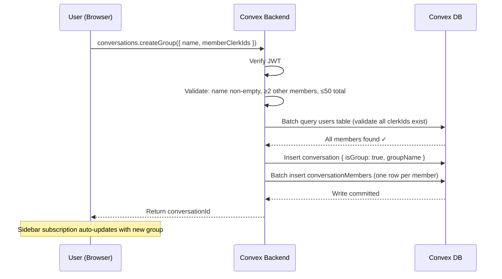
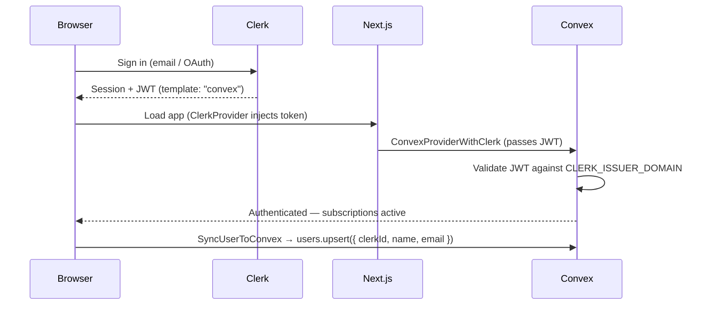
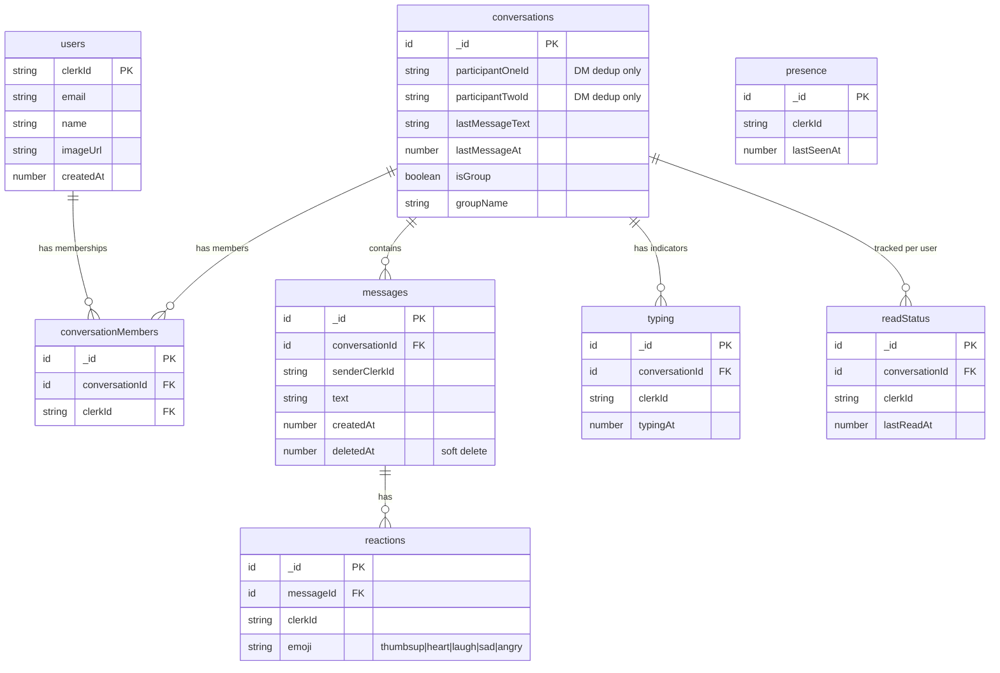

# TARS Chat — Real-Time Messaging App

A full-featured, real-time chat application built with **Next.js 16**, **Convex**, and **Clerk**, styled after the WhatsApp Web dark theme. Supports 1-on-1 direct messages, group conversations, emoji reactions, typing indicators, online presence, unread badges, and more.

> **Assignment submission for TARS** — demonstrates proficiency in Next.js (App Router), real-time backends, authentication, and modern UI.

---

## Table of Contents

- [TARS Chat — Real-Time Messaging App](#tars-chat--real-time-messaging-app)
  - [Table of Contents](#table-of-contents)
  - [Features](#features)
    - [1. Authentication \& User Profiles](#1-authentication--user-profiles)
    - [2. User List \& Search](#2-user-list--search)
    - [3. One-on-One Direct Messages](#3-one-on-one-direct-messages)
    - [4. Message Timestamps](#4-message-timestamps)
    - [5. Empty States](#5-empty-states)
    - [6. Responsive Layout](#6-responsive-layout)
    - [7. Online / Offline Status](#7-online--offline-status)
    - [8. Typing Indicator](#8-typing-indicator)
    - [9. Unread Message Count](#9-unread-message-count)
    - [10. Smart Auto-Scroll](#10-smart-auto-scroll)
    - [11. Delete Own Messages](#11-delete-own-messages)
    - [12. Message Reactions](#12-message-reactions)
    - [13. Loading \& Error States](#13-loading--error-states)
    - [14. Group Chat](#14-group-chat)
    - [Bonus Features](#bonus-features)
  - [Tech Stack](#tech-stack)
  - [Architecture Overview](#architecture-overview)
    - [Sequence Diagram — Sending a Message](#sequence-diagram--sending-a-message)
    - [Sequence Diagram — Creating a Group](#sequence-diagram--creating-a-group)
    - [Sequence Diagram — Authentication Flow](#sequence-diagram--authentication-flow)
  - [Database Schema](#database-schema)
  - [Project Structure](#project-structure)
  - [Getting Started](#getting-started)
    - [Prerequisites](#prerequisites)
    - [Installation](#installation)
    - [Environment Variables](#environment-variables)
    - [Clerk JWT Template](#clerk-jwt-template)
    - [Run the App](#run-the-app)
  - [Design Decisions](#design-decisions)
    - [Unified `conversationMembers` Table](#unified-conversationmembers-table)
    - [Soft Delete Pattern](#soft-delete-pattern)
    - [Smart Auto-Scroll](#smart-auto-scroll)
    - [WhatsApp Dark Theme](#whatsapp-dark-theme)
  - [Scripts](#scripts)

---

## Features

### 1. Authentication & User Profiles
Clerk handles sign-in (email / OAuth). On every login the `SyncUserToConvex` component upserts the Clerk user (clerkId, name, email, avatar) into the Convex `users` table, keeping profile data in sync.

### 2. User List & Search
The home page shows all registered users except yourself. A search bar filters users by name as you type (powered by `cmdk`). Clicking any user card calls `conversations.getOrCreate` to open or create a DM instantly. A global **⌘K / Ctrl+K** shortcut opens the search from anywhere (SSR-safe platform detection for the keyboard badge).

### 3. One-on-One Direct Messages
Users can have private conversations. Messages appear in real time for both sides via Convex subscriptions (WebSocket). The sidebar lists all conversations with a preview of the most recent message and timestamp, sorted by recency.

### 4. Message Timestamps
Every message bubble shows when it was sent:
- **Today** → time only (e.g. `2:34 PM`)
- **Yesterday / older** → date label separator (`Yesterday`, `Feb 15`)
- **Different year** → date includes year (`Feb 15, 2024`)

Date separator pills appear between messages from different days.

### 5. Empty States
Helpful placeholders prevent blank screens everywhere:
- **No conversations yet** → sidebar shows an illustration + "New conversation" button
- **No messages in a conversation** → centered prompt "Send a message to start your conversation with X"
- **No conversation selected** → full-panel prompt "Pick a conversation from the sidebar"
- **No search results** → "No users found." / "No matching conversations — try a different search term"

### 6. Responsive Layout
- **Desktop:** sidebar (320 px) + chat area side by side
- **Mobile:** conversation list as the default view; tapping a conversation opens full-screen chat with a ← back button in the header

Uses Tailwind responsive breakpoints (`md:`) throughout.

### 7. Online / Offline Status
A green dot indicator appears next to users who currently have the app open. Presence is tracked via a **10-second heartbeat** mutation; a Convex cron job runs every 10 s to purge stale presence rows (> 20 s old), flipping users to "offline" in real time.

### 8. Typing Indicator
Shows **"Alex is typing…"** with a pulsing-dots animation when the other user is typing. In group chats, multiple typers are resolved by name (e.g. **"Alex, Sam are typing…"**). Indicators disappear after ~2 seconds of inactivity or when the message is sent (debounced keystroke handler with auto-cleanup).

### 9. Unread Message Count
Each conversation in the sidebar shows a badge with the number of unread messages (excludes soft-deleted messages). The badge clears when the user opens that conversation (`readStatus.markRead`). Updates in real time via Convex subscription.

### 10. Smart Auto-Scroll
New messages auto-scroll into view — **unless** the user has scrolled up to read older messages. An `IntersectionObserver` watches a sentinel div at the bottom of the scroll area. When the user is not at the bottom, a **"New messages ↓"** pill button appears; clicking it scrolls to the latest message.

### 11. Delete Own Messages
Users can delete messages they sent. The record stays in Convex (soft delete via a `deletedAt` timestamp) and all participants see *"This message was deleted"* in italics. If the deleted message was the latest in the conversation, the sidebar preview updates to reflect it.

### 12. Message Reactions
Users can react to any message with a fixed set of emojis — 👍 ❤️ 😂 😢 😠. Clicking the same reaction again removes it (toggle). Reaction counts are displayed below the message bubble, and the current user's own reactions are highlighted. Reactions are fetched in a single batched query (`reactions.getForMessages`) for efficiency.

### 13. Loading & Error States
Skeleton loaders (pulse placeholders) are shown while conversations and messages are loading. If a message fails to send, it appears with a red error indicator and a **Retry** button so the user can re-send without retyping. Network and service errors are handled gracefully throughout.

### 14. Group Chat
Users can create a group conversation by selecting multiple members (3–50) and giving it a name. All members see messages in real time via Convex subscriptions. The sidebar displays the group name, member count, and the latest message preview. Member IDs are validated against the `users` table before creation.

### Bonus Features

| Category | Details |
|---|---|
| **Profile / Avatar** | Upload custom avatar via Convex file storage (5 MB max) with hydration-safe dialog |
| **WhatsApp Dark Theme** | Hand-tuned palette: `#0b141a` chat bg, `#005c4b` sent bubbles, `#00a884` accent |

---

## Tech Stack

| Layer | Technology | Version |
|---|---|---|
| Framework | [Next.js](https://nextjs.org) (App Router, Turbopack) | 16.1.6 |
| Runtime | [React](https://react.dev) | 19.2.3 |
| Backend / DB | [Convex](https://convex.dev) (real-time, reactive) | 1.32.0 |
| Auth | [Clerk](https://clerk.com) (JWT → Convex) | 6.38.1 |
| Styling | [Tailwind CSS v4](https://tailwindcss.com) + [shadcn/ui](https://ui.shadcn.com) | 4.x |
| Command Palette | [cmdk](https://cmdk.paco.me) | 1.1.1 |
| Icons | [Lucide React](https://lucide.dev) | 0.575.0 |
| Language | TypeScript | 5.x |

---

## Architecture Overview

The app follows a **client ↔ Convex** pattern — there is no custom API server. Convex handles the database, real-time subscriptions, mutations, and auth verification via Clerk-issued JWTs.

```
┌──────────────────┐        JWT        ┌──────────────────┐
│   Next.js App    │ ◄──────────────── │      Clerk       │
│   (React 19)     │                   │   (Auth Provider) │
└────────┬─────────┘                   └──────────────────┘
         │
         │  useQuery / useMutation (WebSocket)
         ▼
┌──────────────────┐
│     Convex       │
│  (Backend + DB)  │
│                  │
│  • queries       │  ← reactive subscriptions (real-time)
│  • mutations     │  ← transactional writes
│  • cron jobs     │  ← stale presence cleanup
└──────────────────┘
```

### Sequence Diagram — Sending a Message



### Sequence Diagram — Creating a Group



### Sequence Diagram — Authentication Flow



---

## Database Schema

Eight tables in Convex, unified through the `conversationMembers` table for all membership lookups:



**Key indexes:**

| Table | Index | Purpose |
|---|---|---|
| `users` | `by_clerkId` | O(1) user lookup from Clerk subject |
| `conversations` | `by_pair` | DM dedup via sorted (participantOneId, participantTwoId) |
| `conversationMembers` | `by_clerkId` | "List my conversations" — single scan |
| `conversationMembers` | `by_conversation` | "List members of a conversation" |
| `conversationMembers` | `by_conversation_member` | O(1) membership check (compound) |
| `messages` | `by_conversation` | Ordered message fetch per conversation |
| `reactions` | `by_message` / `by_message_user` | Batched reaction lookup, toggle dedup |
| `readStatus` | `by_user_conversation` | Per-user read cursor |
| `typing` | `by_conversation` / `by_user_conversation` | Active typers, upsert guard |

---

## Project Structure

```
my-app/
├── app/
│   ├── globals.css                  # Tailwind v4 imports + WhatsApp dark palette
│   └── (root)/
│       ├── layout.tsx               # ClerkProvider → ConvexProvider → header + nav
│       ├── page.tsx                  # Home — Discover Users grid
│       └── messages/
│           └── page.tsx             # Chat view — sidebar + message thread
├── components/
│   ├── conversation-sidebar.tsx     # Sidebar: search, groups, unread badges, skeletons
│   ├── discover-users.tsx           # ⌘K user search + user cards
│   ├── message-thread.tsx           # Messages, reactions, smart scroll, typing
│   ├── online-indicator.tsx         # Green dot for presence
│   ├── presence-provider.tsx        # Heartbeat pump (10 s interval)
│   ├── profile-settings.tsx         # Avatar upload dialog (Convex file storage)
│   ├── reaction-bar.tsx             # Emoji picker popover
│   ├── sync-user-to-convex.tsx      # Upserts Clerk user → Convex on auth
│   ├── typing-bubble.tsx            # "X is typing…" indicator with dots
│   ├── providers/
│   │   └── convex-client-provider.tsx
│   └── ui/                          # shadcn/ui primitives (Button, Dialog, etc.)
├── convex/
│   ├── schema.ts                    # 8-table schema definition
│   ├── helpers.ts                   # Shared isMember() helper
│   ├── conversations.ts            # getOrCreate, createGroup, listForUser, getById
│   ├── messages.ts                  # send, list, deleteMessage
│   ├── reactions.ts                 # toggle, getForMessages
│   ├── readStatus.ts               # markRead, unreadCounts
│   ├── presence.ts                  # heartbeat, isOnline, removeStale
│   ├── typing.ts                    # setTyping, getTyping
│   ├── users.ts                     # upsert, listAll, getByClerkId
│   ├── crons.ts                     # Stale presence cleanup (every 10 s)
│   └── auth.config.ts              # Clerk issuer domain config
├── hooks/
│   ├── use-presence-heartbeat.ts   # 10 s heartbeat + visibility handlers
│   └── use-typing-indicator.ts     # Debounced keystroke → setTyping
├── types/
│   └── chat.ts                      # ChatMember, ConversationItem, EmojiKey, EMOJI_MAP
├── lib/
│   ├── constants.ts                 # HEADER_HEIGHT, SIDEBAR_WIDTH, MAX_AVATAR_SIZE
│   └── utils.ts                     # cn() helper (clsx + tailwind-merge)
└── public/                          # Static assets
```

---

## Getting Started

### Prerequisites

- **Node.js** ≥ 18
- **npm** (or pnpm / yarn)
- A [Clerk](https://clerk.com) account (free tier works)
- A [Convex](https://convex.dev) account (free tier works)

### Installation

```bash
git clone https://github.com/Prince-PT/Tars_assignment.git
cd Tars_assignment/my-app
npm install
```

### Environment Variables

Copy the example file and fill in your credentials:

```bash
cp .env.example .env.local
```

| Variable | Where to find it |
|---|---|
| `CONVEX_DEPLOYMENT` | Convex dashboard → Settings → Deployment slug |
| `NEXT_PUBLIC_CONVEX_URL` | Convex dashboard → Settings → Deployment URL |
| `NEXT_PUBLIC_CONVEX_SITE_URL` | Same dashboard, the `.site` variant |
| `NEXT_PUBLIC_CLERK_PUBLISHABLE_KEY` | Clerk dashboard → API Keys |
| `CLERK_SECRET_KEY` | Clerk dashboard → API Keys |

> **Important:** `CLERK_ISSUER_DOMAIN` must be set in the **Convex dashboard** environment variables (not `.env.local`). Find your issuer URL in Clerk dashboard → JWT Templates → "convex".

### Clerk JWT Template

1. In Clerk dashboard, go to **JWT Templates** → **New template**
2. Choose the **Convex** template (or create a custom one)
3. Set the **Issuer** to your Clerk frontend API URL
4. Set `applicationID` claim to `"convex"`
5. Copy the **Issuer** URL → paste into Convex dashboard env as `CLERK_ISSUER_DOMAIN`

### Run the App

```bash
# Terminal 1 — start Convex dev server (watches schema + functions)
npx convex dev

# Terminal 2 — start Next.js
npm run dev
```

Open [http://localhost:3000](http://localhost:3000) — sign in with Clerk, and you're ready to chat.

---

## Design Decisions

### Unified `conversationMembers` Table

Early versions used `participantOneId` / `participantTwoId` fields on the `conversations` table for DMs, creating a **dual membership path** that required triple-query + dedup logic for "list my conversations." The codebase was unified to use a single `conversationMembers` table for **both** DMs and groups, giving:

- **One code path** for listing conversations (`by_clerkId` index scan)
- **O(1) membership checks** via compound `by_conversation_member` index
- **Extensible** — adding/removing group members is a row insert/delete

The `participantOneId` / `participantTwoId` fields are retained (optional) solely for DM dedup via the `by_pair` index.

### Soft Delete Pattern

Messages use a `deletedAt` timestamp instead of hard deletion. This preserves conversation history integrity, allows "This message was deleted" UI treatment, and sidebar preview updates re-query the latest non-deleted message.

### Smart Auto-Scroll

Uses `IntersectionObserver` with the `ScrollArea` viewport as the observation root (not the page viewport). A 1px sentinel div at the bottom of the message list is observed — if it's visible, new messages auto-scroll into view. If the user has scrolled up to read history, a "New messages ↓" pill appears instead.

### WhatsApp Dark Theme

Custom CSS variables map to the WhatsApp Web dark palette for a familiar feel:

| Token | Value | Usage |
|---|---|---|
| `--chat-bg` | `#0b141a` | Chat background |
| `--sidebar-bg` | `#111b21` | Sidebar background |
| `--panel-bg` | `#202c33` | Header / panels |
| `--sent` | `#005c4b` | Sent message bubbles |
| `--received` | `#1f2c34` | Received message bubbles |
| `--accent` | `#00a884` | Primary accent / buttons |
| `--text` | `#e9edef` | Primary text |
| `--muted` | `#8696a0` | Secondary / muted text |

---

## Scripts

| Command | Description |
|---|---|
| `npm run dev` | Start Next.js dev server (Turbopack) |
| `npm run build` | Production build |
| `npm run start` | Start production server |
| `npm run lint` | Run ESLint |
| `npx convex dev` | Start Convex dev server (watches + deploys functions) |
| `npx convex deploy` | Deploy Convex functions to production |

---

**Built by [Prince Thakkar](https://github.com/Prince-PT)** as a TARS assignment submission.
